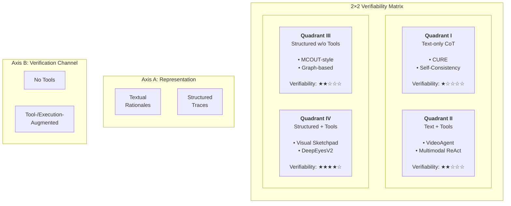
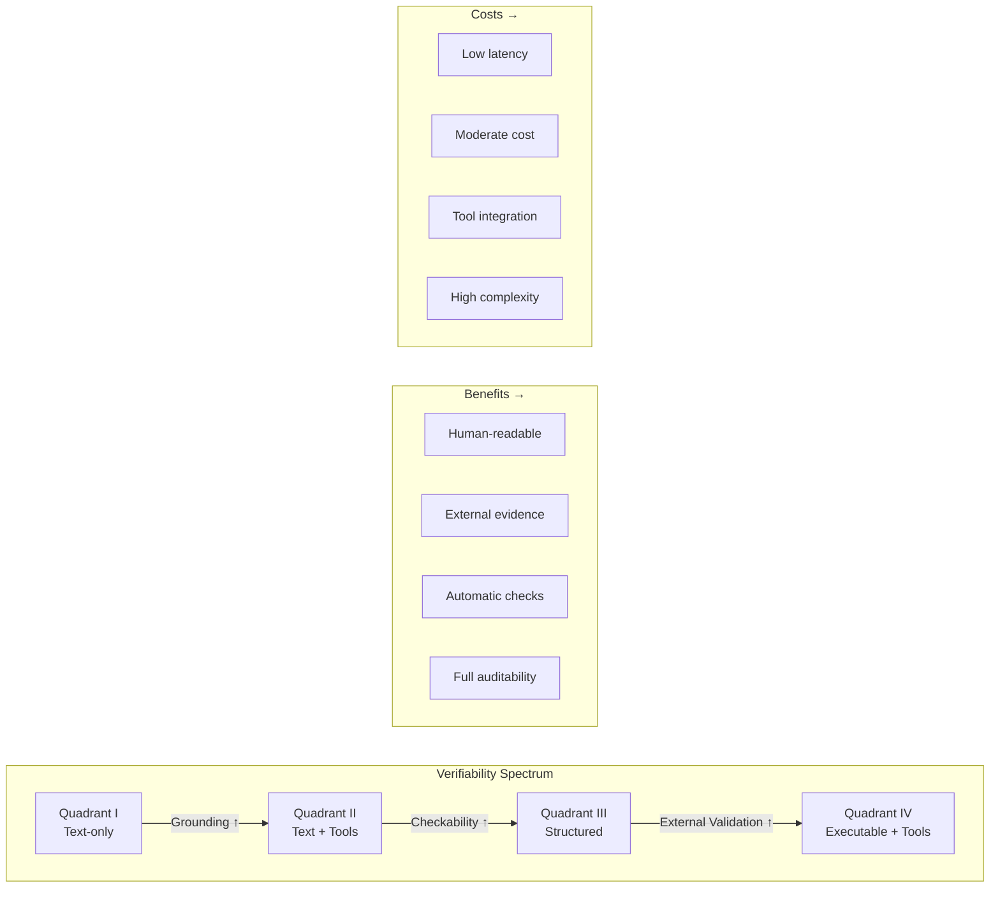
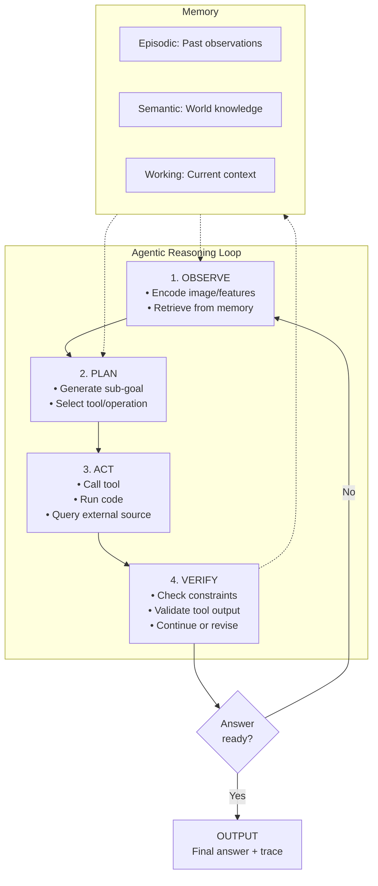
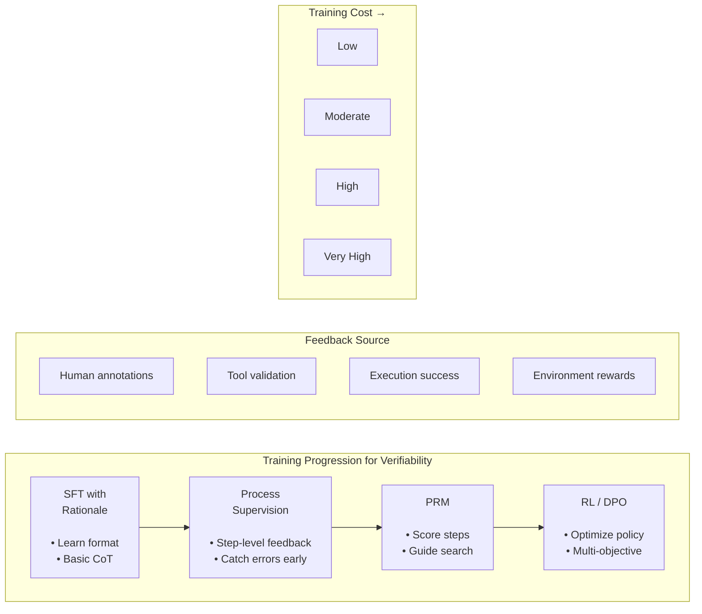
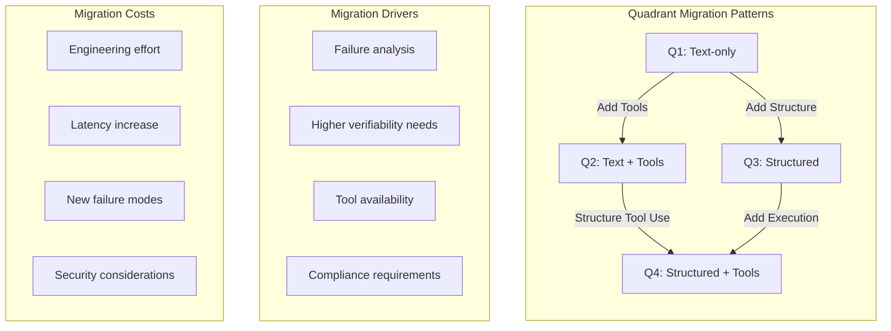
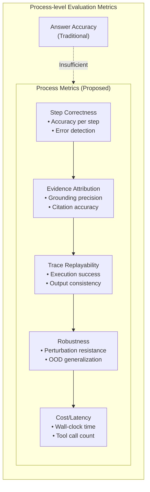

# Figures for Survey

## Figure 1: 2×2 Verifiability Matrix

**Caption**: Figure 1: The 2×2 Verifiability Matrix organizes multimodal reasoning methods by intermediate representation (textual vs. structured) and verification channel (no tools vs. tool-augmented). Moving from Q1 → Q4 generally increases verifiability at the cost of complexity and latency.

---

## Figure 2: Verifiability Spectrum

**Caption**: Figure 2: Verifiability exists on a spectrum. Moving rightward increases verification capabilities but also increases cost, latency, and complexity. The optimal position depends on application requirements.

---

## Figure 3: Agent Loop Architecture

**Caption**: Figure 3: The agentic reasoning loop interleaves perception, planning, action, and verification. Memory maintains context across iterations. The loop continues until the agent can produce a verified answer.

---

## Figure 4: Training Progression

**Caption**: Figure 4: Training methods progress from simple imitation (SFT) to process-guided optimization (RL). Each stage adds more explicit verifiability signals but increases training complexity.

---

## Figure 5: Quadrant Migration

**Caption**: Figure 5: Methods can migrate between quadrants during design or deployment. Migration is driven by failure analysis, application requirements, or tool availability, but incurs engineering and operational costs.

---

## Figure 6: Evaluation Metrics Hierarchy

**Caption**: Figure 6: Process-level metrics complement traditional answer accuracy. These five categories (Step Correctness, Evidence Attribution, Trace Replayability, Robustness, Cost/Latency) provide a comprehensive evaluation framework.

---

## Notes for Figure Creation

### Tools for Creating Final Figures

1. **Mermaid.js**: For flowcharts and diagrams (used above)
2. **TikZ/LaTeX**: For publication-quality vector graphics
3. **Python (matplotlib/seaborn)**: For data visualizations
4. **Figma/Illustrator**: For manual design and polish

### Color Scheme Recommendations

- **Quadrant I**: Blue (calm, simple)
- **Quadrant II**: Green (growth, tools)
- **Quadrant III**: Orange (structure, intermediate)
- **Quadrant IV**: Red (power, complexity)

### Layout Guidelines

- Use consistent iconography across figures
- Ensure figures are readable in grayscale
- Include clear captions with key insights
- Reference figures in text (e.g., "As shown in Figure 1...")
